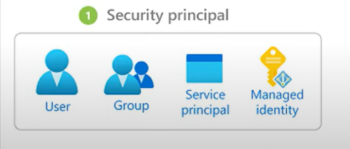
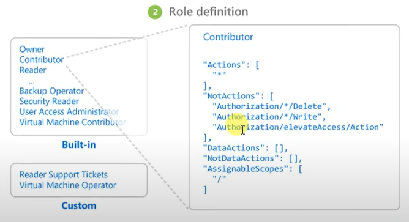
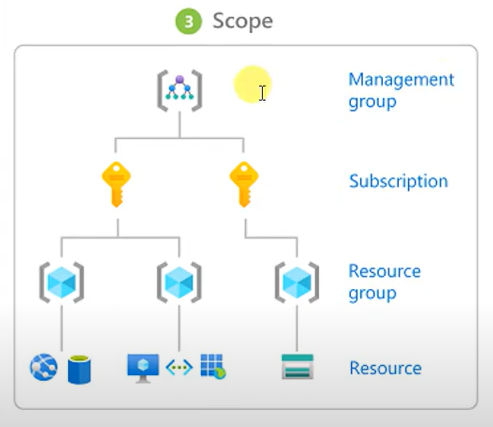

# Azure Identity Server

Intially we were using work domain and after that we come across domain.
## Identity Server
An Identity Server is a tool that manages who can access various applications and services within an organization. Think of it like a security guard at the entrance of a building.

Identity Server is an open-source authentication and authorization platform that implements the OpenID Connect and OAuth 2.0 standards. It provides developers with a way to add centralized login functionality to applications, ensuring that users can authenticate securely and access resources according to their permissions.
## Real-Time Example of Why We Need Identity Server

### Scenario: Global Financial Services Firm

A global financial services firm operates in multiple countries, offering banking, investment, and insurance services. With thousands of employees, clients, and partners accessing its systems daily, the firm faces several challenges.

### Challenges

1. **Complex IT Environment**: The firm uses various applications, both on-premises and in the cloud, each requiring secure access control.
   
2. **Security Risks**: Sensitive financial data needs protection, ensuring only authorized users have access.

3. **Regulatory Compliance**: The firm must meet financial regulations like GDPR and PCI-DSS, requiring strict access controls and audit trails.

4. **User Experience**: Employees and clients need seamless access to multiple systems without frequent logins.

### Solution: Implementing an Identity Server

1. **Centralized Authentication**: Identity Server centralizes user authentication, simplifying credential management and enhancing security.

2. **Single Sign-On (SSO)**: Users log in once to access all applications, improving productivity and satisfaction.

3. **Multi-Factor Authentication (MFA)**: Adds security by requiring additional verification steps.

4. **Role-Based Access Control (RBAC)**: Ensures users access only resources relevant to their roles.

5. **Integration with Cloud Services**: Consistent access management across on-premises and cloud environments.

6. **Compliance and Auditing**: Provides detailed logs to meet regulatory compliance and conduct audits.

### Benefits

- **Improved Security**: Reduces unauthorized access risks, protecting sensitive data.(The Identity Server ensures that only authorized people can access certain applications and data, much like a guard checking if you have the right credentials to enter a secure area.)
- **Enhanced User Experience**: Simplifies the login process, allowing users to focus on tasks. (With an Identity Server, you only need to log in once to access all the services and applications you're allowed to use. It's like having a single key that opens multiple doors.)
- **Regulatory Compliance**: Ensures compliance with financial regulations.(The Identity Server keeps track of who accesses what, helping organizations follow rules and regulations. It's like maintaining a log of who visits which areas in a building for security purposes.)
- **Streamlined IT Management**: Simplifies managing multiple applications and systems.(It helps organizations easily add new users, adjust their access rights, or remove access when necessary. This is similar to updating a list of who can enter a building or specific rooms.)

## What is Active Directory?
Active directory is an identity provider. Microsoft introduced it with Windows Server 2000. It is a centralized repository of users, groups, devices, and organizational units. 

It manages group policies to control different objects and provides a centralized authentication system.

**Use Case**: An organization can use group policy to display a single wallpaper across all 500 employees' devices.

Active directory is used to manage permissions and access to networked resources. We can integrate AD with Identity Server to leverage its existing user and group management capabilities for authentication purposes.

**Integration**: Identity Server can use AD as a user store, allowing organizations to authenticate users against their existing AD infrastructure.
**Federation**: By integrating with AD, Identity Server can provide federated identity services, enabling users to access resources in different domains without needing separate credentials.

## What is azure AD?
Azure Active Directory (Azure AD) is a cloud-based identity and access management service provided by Microsoft. It helps organizations manage user identities and access to resources both on-premises and in the cloud. 

Azure AD offers features like single sign-on, multi-factor authentication, and conditional access to ensure secure and efficient management of users and resources.

In azure AD azure will copy of your directory data in to atleast 2 reason for high availability. So even a datacenter will go down it is highly relible.

**Use Case**: A multinational corporation with employees working remotely can use Azure AD to provide secure access to corporate applications. Employees can log in once using single sign-on (SSO) and access all necessary applications without having to enter credentials multiple times. This improves productivity and security by ensuring that only authorized users can access sensitive resources.

## Why Do We Need Azure AD?

Organizations need Azure AD to streamline identity management and enhance security for users and resources. With the increasing shift to cloud-based solutions and remote work, managing access efficiently and securely is crucial. Azure AD provides tools to manage user identities, control access, and ensure compliance with security policies.

**Use Case**: A university with students, faculty, and staff using various online platforms for learning and administration can implement Azure AD to manage access. Azure AD enables the university to enforce policies like multi-factor authentication, ensuring that only authorized users access sensitive information like grades or payroll data. It also simplifies the login process for users, allowing them to access multiple applications with a single set of credentials.

## Azure active directory Roles, RBAC, Custom Roles

## Azure AD Roles
The roles that can manage only azure AD resource, like if you remember in on premisis in Active directory we have a role that called Domain Admin that role manage the domain controller in Active directory, that basically create the user manage the password and manage the group policies, Similiarly azure AD roles manage azure AD.

Azure AD roles have there own responsibilities, it never impact any other roles responsibilities.
1) **Global Administrator**: 
Manage access to all administrative feature as well as service that are dependent to azure AD.
Assign administrator roles to others.
Reset the password for any used and all other administartors.

2) **User administartor**:
Create and manage all user and groups.
Manage support tickets
Monitor health Service
Change passwords for user, helpdesk administartor and other user administrators

2) **Billing administartor**:
Create subscriptions
Manage subscriptions
Manage support tickets
Monitor health Service

## Azure AD RBAC
Azure role-based access control (Azure RBAC) helps us to manage the access of Azure resources, means what all access is required for a resource read or write, and at what level  access is required role based or group based or subscription level.

A role assignment consists of three elements: security principle, role definition and scope.

1) Security principle
A security principle is an object that represents a **user, group, service principle or managed identity** that is requesting access to azure resources. We can assign a role to any of these security principles.

2) Role definition
A role definition is a collecction of permission and it is JSON based document, it is typically just called a role. A role definition lists the operations that can be performed such as read write and delete, Roles can be high level like owner or specific like virtual machine reader.

So let us say if we have created a role so which type of definition (owner, reader, contributor) we are going to provide that comes under role definition.

3) Scope
Scope is the set of resources where the access applies to, when we create a role we can ferther limit the actions allowed by a definition scope.

This is helpful if you want to makw someone a website Contributor, but only for one resource group.

In Azure we can specify a scope at four levels.
1) Management group
2) Subscription
3) Resource group
4) Resource
Scopes are structured in a parent-child relationship

# Lab - 1
## Create an user and provide a role on different level
1) **Step 1**: Create an user(tom) from azure active directory
2) **Step 2**: Create a resource group
3) **Step 3**: Go on resource group -> Access control(IAM)->Add> Add role Assignment->Role(Contributor)->Assign Access to(User, group, or service principle)->Select(created username tom)
4) **Step 4**:We can create another resource group and it will be not accessible to (tom)

We can also create a custom role.

## Custom Roles
If the Azure built-in roles don't meet the specific needs of our organization we can create our own custom roles, just like built in roles and we can assign custom roles to users, groups and service principles at managment group, subscription and resource group scopes.
Custom roles can be shared between subscription that trust the same azure AD directory, there is a limit of 5000 custom roles per directory.

- **Prerequisites**
To create custom roles we need :
- Permission to create custom role, such as Owner or User Acess Administrator

**use case** - customized laptop, customised clother

# Lab - 2
## Create a custom Role
1) **Step 1**: Go to Subscription-> Roles (here all built-in roles are available)->Add->Add Custom Role
2) **Step 2**: Add Custom Role->Basics->Custom Role Name->Start from Scratch->Next
3) **Step 3**: Add permission->Compute(Microsoft Compute)->go to virtual machine section(Start Virtual Permission)
4) **Step 4**: Add permission->Compute(Microsoft Storage)->go to Storage section(Delete Storage Account)
5) **Step 5**: Add scope (Management Group, Subscription level, resource group or resource)

## Create a custom Role using Powershell
We have to write the below commands to create the new custom role

first we need to open local powershell in admin mode

**Step 1**: connect-AzAccount -> need to put credentials

**Step 2**: New-AzRoleDefinition -InputFile "custom-role.json"

Below command will assign the permissions to the user on newly created custom role on the resource group

**Step 3**: New-AzRoleAssignment -ResourceGroupName "rgname" -SignInName userid -RoleDefinitionName "rolename"

Now we can go in resource group -> IAM and we can see the assigned roles here.

# On Premise AD vs Azure AD
On Premise AD uses NTDS(Jet database), it can add machine to domain, it can apply group policy.
On Premise AD require physical or VM to deploy, and replication is possible between DC's

Azure AD uses SQL database , there is no support to join machine except windows 10 for SSO also ther is provision for group policy.
Azure AD  doesnot require physical or VM to deploy it comes PAAS, and replication is is managed by Azure across 3 region.

# Azure AD Connect
Synchronyzing on premise AD users to Azure AD we use AD Connect, we can download this tool and install in any of the member server or any domain controller in our On-Premise Enviournment

Using the AD connect we can take advantage like:

- User can use a single identity to access on-premises application and cloud services such as Microsoft 365.
- Single tool provide an easy deployment experience for syncronizing and sign in.
- Provides the newest capabilities for your senario. Azure AD connect replaces older version identity intigration tools like DirSync and Azure AD Sync.

## Azure AD Connect Features
1) **Password Hash synchronization**:
2) **Pass through authentication**:
3) **Fedrated intigration**:
4) **Synchronization**:
5) **Health Monitoring**:
6) **Filtering**:
7) **Password Write Back**:
8) **Device Writeback**:
8) **Automatic Upgrade**:
